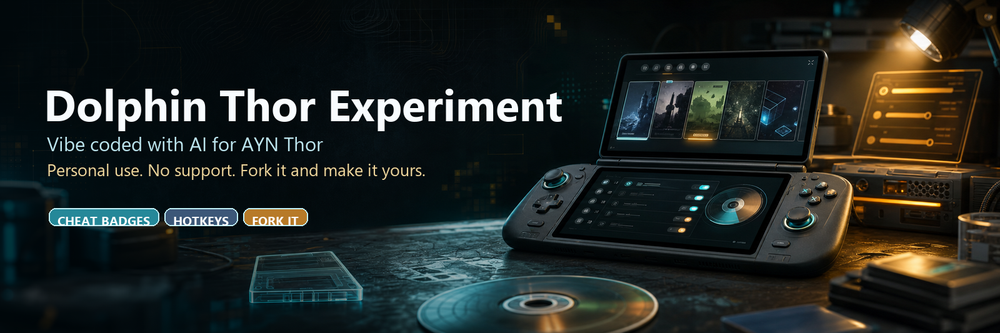
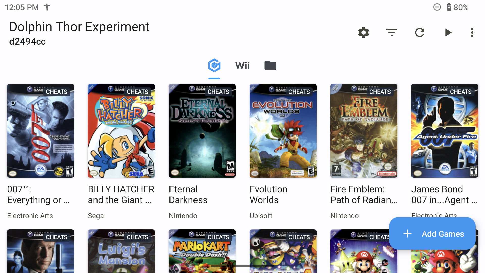
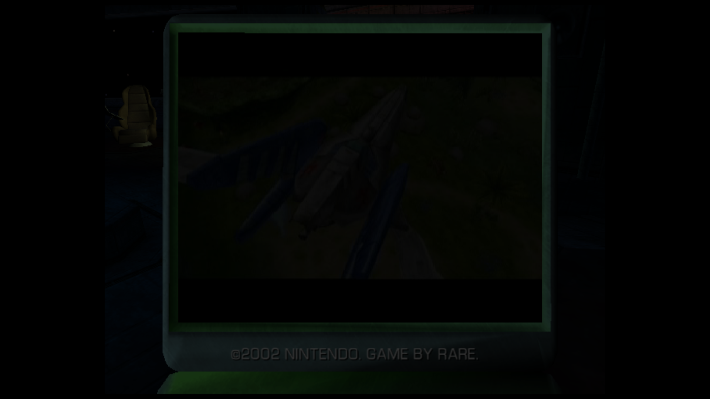
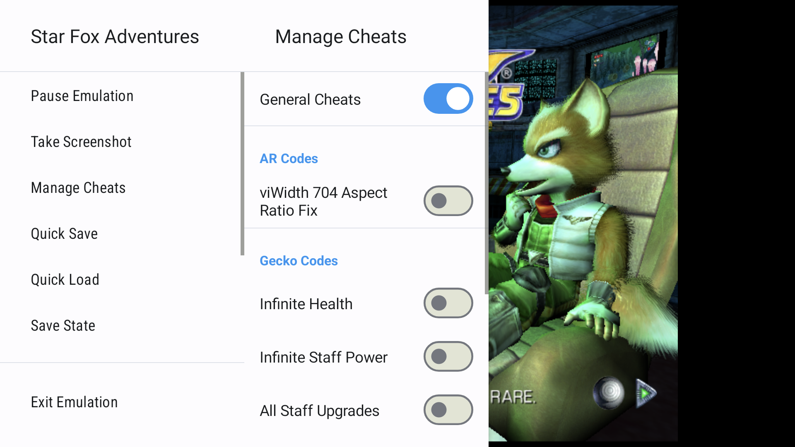

# Dolphin Thor Experiment



This is a personal Android experiment fork of Dolphin for the AYN Thor.

It is vibe coded with AI assistance. It is practical, messy, device-focused work aimed at making one real handheld do what I want. There is no guarantee of stability, correctness, compatibility, performance, or support. If AI/vibe-coded emulator forks are a problem, please use upstream Dolphin, another fork, or fork this repo and do your own thing.

Please do not open issues here. This is not a support queue. Fork it, patch it, break it, fix it.

## Screenshots







## What This Fork Is

- A personal-use AYN Thor Android fork, not a general Android compatibility promise.
- A Dolphin Android build branded as `Dolphin Thor Experiment`.
- A cheat-helper experiment for visible cover badges, bundled cheat lookup, and faster in-game cheat control.
- A handheld workflow branch for Thor/Odin-style controller profiles, savestates, speed toggles, and release-build testing.
- A repo you should fork if you want different behavior. I am not trying to maintain this as a public support project.

This project does not include games, keys, firmware dumps, or system files.

## Clear Divergence From Upstream Dolphin

This fork intentionally diverges from a plain Dolphin Android build in several places:

- Android app branding, launcher icon, TV banner, screenshots, and docs are visibly separate from upstream Dolphin.
- Game covers show small cheat-availability badges on the Android phone/tablet grid and TV/Leanback cards.
- Cheats are enabled by default for this fork.
- A bundled Gecko-code cache is carried under `Data/Sys/GeckoCodes.zip`, generated from the RC24/GameHacking mirror notes in `Data/Sys/GeckoCodes.README.txt`.
- GameCube Action Replay additions are carried where Gecko data is missing, including Fire Emblem: Path of Radiance coverage.
- The Android in-game menu exposes cheat management directly, with a general cheat toggle and visually separated per-cheat toggles.
- Android hotkeys default to Select + right stick down for quick save, Select + right stick up for quick load, and Select + R for speed toggle.
- Savestates are enabled by default for this fork's Android workflow.
- Fast-forward uses a user-configurable percentage with a 200% default and preserves audio pitch.
- Optional AYN/Odin-style controller profiles are included for GameCube, Wii Classic Controller, and Wii Remote + Nunchuk layouts.
- AYN Thor rumble is routed through Android game/media vibration instead of pretending every Android haptic path behaves the same.
- Release builds are the normal Thor testing path because debug builds can be much slower.

## Cheat Notes

The bundled cheat cache is not magic. Some games have Gecko codes, some have Action Replay codes, some have region-specific entries, and some have nothing useful in public mirrors. The fork tries to make cheat availability obvious without blocking the library UI on network checks.

If a game you care about is missing cheats, fork the repo and add the codes.

## Building

Android lives in `Source/Android`.

From the repo root:

```sh
git submodule update --init --recursive
```

From `Source/Android`:

```sh
./gradlew.bat :app:assembleRelease
```

Release builds are the useful builds for Thor performance testing. Debug builds are for chasing crashes, logs, JNI problems, and other sharp edges.

## Credit

This project stands on other people's work:

- [Dolphin Emulator](https://dolphin-emu.org/), the original GameCube and Wii emulator project.
- [dolphin-emu/dolphin](https://github.com/dolphin-emu/dolphin), the upstream codebase this fork came from.
- [RC24/GameHacking Gecko code mirror](https://codes.rc24.xyz/), used as the source trail for the bundled Gecko-code cache.

Dolphin is licensed under the terms of the GNU General Public License, version 2 or later. This fork's branding, docs, screenshots, and Android experiment notes are part of the experiment; emulator code remains under the applicable upstream licenses.
